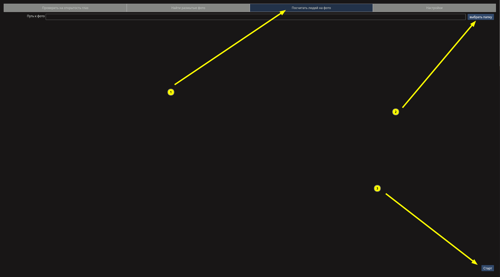
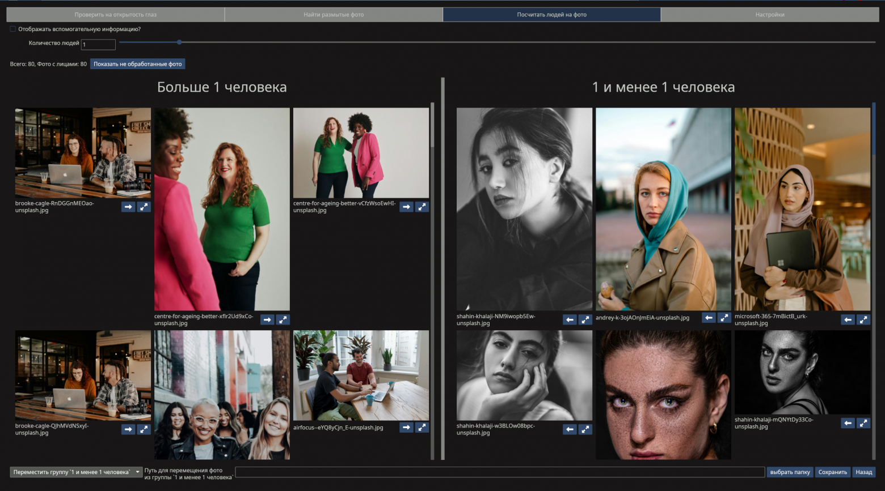
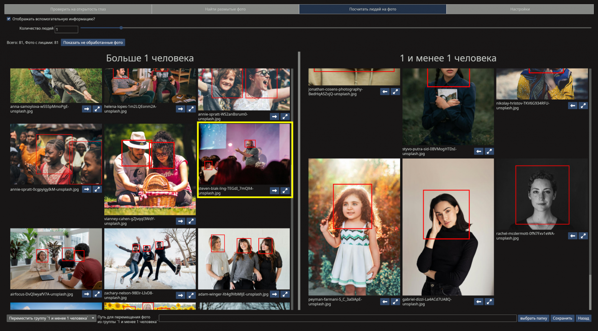
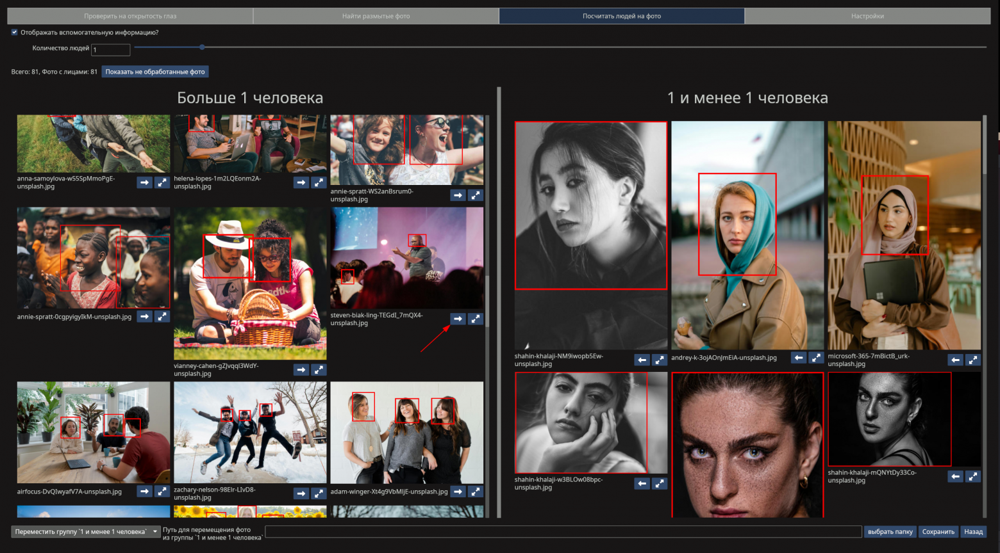
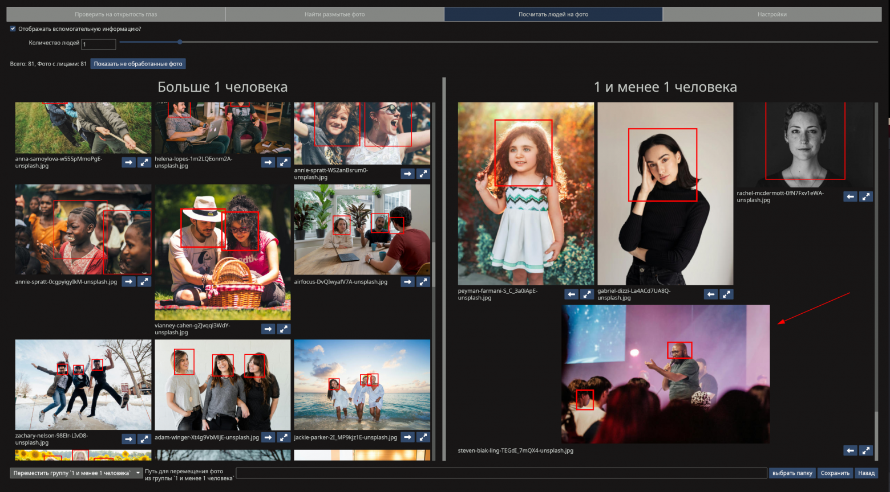
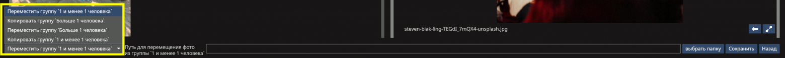
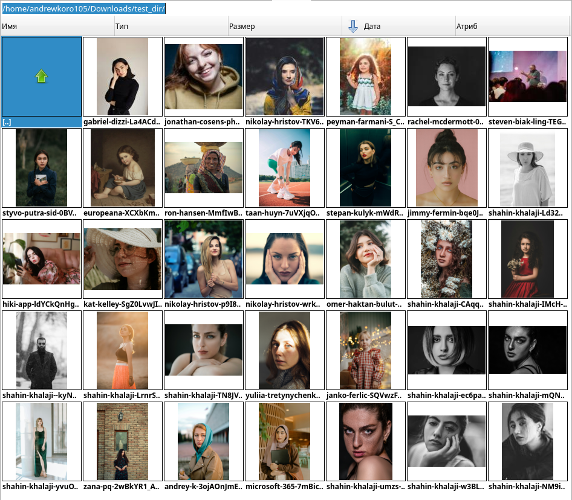

# Sopha туториал: Сортировка фото по числу людей
> Записано на Sopha 0.2.2 (актуально)
## Ведение
### Что такое Sopha
Sopha (SOrting PHoto fAce) это программа для сортировки фото с помощью нейросетей, созданная для ускорения работы фотографов. В этой статье будет рассказано о такой её функции как сортировка фото по числу людей.

Скачать Sopha и почитать о ней подробнее можно в Telegram канале https://t.me/sorting_photo_face

### Сортировка фото по числу людей
Иногда вам нужно отобрать все фото на которых только 1 человек и эта функция Sopha предоставит вам эту возможность. И даже больше, вы можете отсортировать фото по любому числу людей, а также в будущем она даст возможность быстро сосчитать людей на 1 фотографии.

## Инструкция
### Выбор папки
Чтобы отсортировать фотографии по числу людей в Sopha вы должны перейти на вкладку "Посчитать людей на фото", выбрать папку в которой лежат фото и нажать старт.
В этой папке будут найдены все фото которые может открыть Sopha (в том числе ища в подпапках) и все они будут использованы для сортировки

### Главное меню
По окончанию загрузки вы перейдёте на эту страницу, где фотографии уже будут отсортированы на общие и те на которых 1 человек.

Пороговое число людей можно менять ползунком сверху, или введя своё число руками

Важно отметить что фотографии в группах будут отсортированы по числу людей. Там где число людей больше указанного они идут от меньшего к большему. А в группе, где число людей указанное число и меньше фотографии отсортированы от большего к меньшему

### Болячки нейросетей
К сожалению нейросети не самый точный инструмент и хоть часто они бывают точны, но их стоит проверять. И Sopha даёт вам это сделать очень быстро даже для большого числа фото.

Включив функцию "отображать вспомогательную информацию" вы уведите то где нейросеть нашла людей что позволит просто быстро пролистав все фотки проверить результат (в данном случае для 80 фотографий это займёт около 20 секунд)

В случае нахождения ошибки вы можете тут же переместить фото в другую группу. Например, на выделенной жёлтым фото нейросеть нашла 2 лица, но я считаю что её нужно переместить в группу фотографий с 1 человеком

Для таких случаев есть кнопка ниже (со стрелочкой)

Которая мгновенно переместит эту фотографию в низ другой группы (при изменении порогового числа людей это действие сброситься)

### Сохранение результата
Для сохранения результата работы вам предоставлена панель внизу. Разберём её по порядку.

#### Что мы хотим сделать
Sopha предлагает вам 4 варианта того что вы можете сделать с фотографиями:

- Переместить группу с указанным и меньшим числом людей
- Копировать группу с указанным и меньшим числом людей
- Переместить группу с числом людей большим чем указанно
- Копировать группу с числом людей большим чем указанно

#### Выбор папки и сохранения
Далее вам нужно выбрать папку куда вы хотите переместить фото, введя путь или нажав кнопку "выбрать папку".

После нажмите кнопку "Сохранить" и программа перейдёт на стартовый экран, выполнив указанное действие.

Например, если выбрать вариант "Копировать группу \`1 и менее 1\`", выбрать папку "/home/andrewkoro105/Downloads/test_dir/" и нажать сохранить.

То в этой папке мы увидим соответствующие фото

# Планы на развитие этой функциональности
> Это пункт будет удалён когда перестанет быть актуальным

В будущем планируется добавление возможности подсчёта лиц на 1 фотографии, кеширование результата работы и масштабное улучшение системы поиска лиц (на данный момент отдан приоритет системе которая очень хорошо находит частично перекрытые лица. Но она имеет ряд проблем которые будут решены в ближайшее время)

